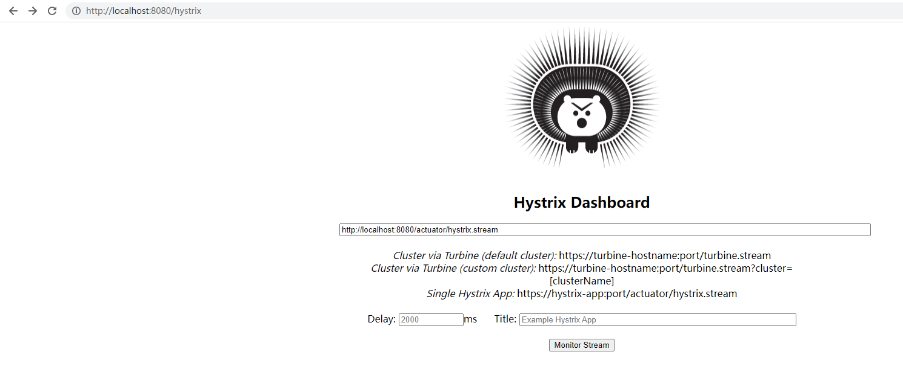

## 配置
```xml
<!-- Maven -->
<dependency>
    <groupId>org.springframework.cloud</groupId>
    <artifactId>spring-cloud-starter-netflix-hystrix</artifactId>
</dependency>
```

```java
// 开启
@EnableCircuitBreaker 或者 @EnableHystrix ，后者继承了前者
```

```java
import org.springframework.stereotype.Service;
import com.netflix.hystrix.contrib.javanica.annotation.HystrixCommand;

@Service
@DefaultProperties(groupKey = "DefaultGroupKey") // 分组
public class YourService {
    @HystrixCommand(fallbackMethod = "fallbackMethod")
    public String yourMethod() {
        // Your code here
    }

    public String fallbackMethod() {
        // Fallback logic here
    }
}
```

线程池和超时设置：
```properties
# 设置全局的超时时间为3秒-默认是1秒
hystrix.command.default.execution.isolation.thread.timeoutInMilliseconds=3000

# 设置全局的线程池大小为10，最大队列大小为100
hystrix.threadpool.default.coreSize=10
hystrix.threadpool.default.maximumQueueSize=100
```

降级：

恢复：

## 控制面板
// Maven
<dependency>
    <groupId>org.springframework.cloud</groupId>
    <artifactId>spring-cloud-starter-netflix-hystrix-dashboard</artifactId>
</dependency>

// 开启
@EnableHystrixDashboard

// 参数获取
management.endpoints.web.exposure.include=hystrix.stream

// 地址
http://localhost:8080/hystrix

// 查看
http://localhost:8080/actuator/hystrix.stream


## 自定义

