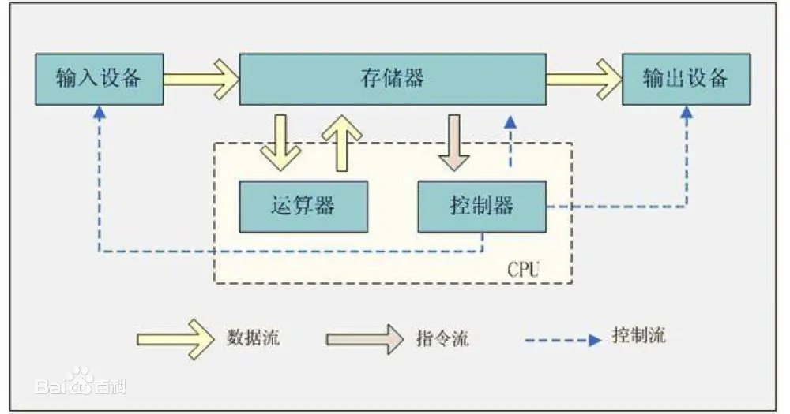
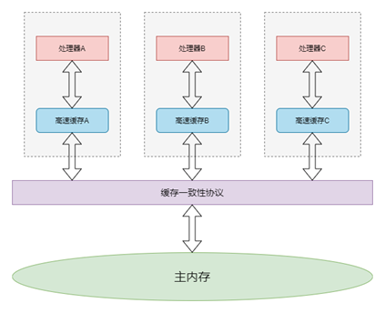
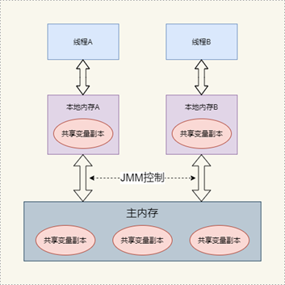

## 为啥需要同步
### 内存模型
#### 计算机的内存模型
现代计算机主要基于冯诺依曼结构，


CPU指令速率和不同存储介质访问速率有差别，引入高速缓存和多处理器，通过缓存一致性协议同步数据。

#### 操作系统的线程模型
现代操作系统大多支持多进程、多线程，操作系统的线程也有竞态问题。线程通信有2个方式：共享数据、消息传递。

### java 内存模型和线程模型
java 借助不同JVM实现了跨平台，JVM 向上处理统一的字节码，向下处理不同的系统，所以JVM面向字节码有一个统一的内存模型，且java的多线程之间是共享内存完成通讯的。

#### 指令重排与内存屏障
cpu流水线优化，允许乱序。存在禁止乱序指令:内存屏障。CPU层面的内存屏障,CPU层面的内存屏障分为三类：

```

写屏障（Store Memory Barrier）：告诉处理器在写屏障之前的所有已经存储在存储缓存(store bufferes)中的数据同步到主内存，简单来说就是使得写屏障之前的指令的结果对写屏障之后的读或者写是可见的。

读屏障（Load Memory Barrier）：处理器在读屏障之后的读操作,都在读屏障之后执行。配合写屏障，使得写屏障之前的内存更新对于读屏障之后的读操作是可见的。

全屏障（Full Memory Barrier）：确保屏障前的内存读写操作的结果提交到内存之后，再执行屏障后的读写操作。
```
JMM 内存屏障

#### happens-before

## 单点JVM同步机制
### volatile和final
主动去主内存刷数据：内存屏障
禁止指令重排

```
volatile 是 Java 中用于实现可见性和禁止指令重排序的关键字，它在底层使用了特定的CPU指令来实现其语义。
在x86架构的CPU上，volatile 使用了以下两个指令：
lock 和 mfence 指令
需要注意的是，不同的CPU架构和型号可能会有不同的底层指令来实现 volatile 的语义。
```
### synchronized
JVM指令：
    monitorenter
    monitorexit

### CAS

```
CAS（Compare and Swap）是一种并发算法，用于实现无锁的线程安全操作。CAS操作在底层使用特定的CPU指令来实现其语义。
在x86架构的CPU上，CAS操作使用了以下指令：cmpxchg 
```
### AQS

#### 同步工具
    CountDownLatch

    Sempheme

    LBQ

    Lock

    Condiction

#### 并发容器

#### 原子类

## 多JVM-集群模式同步机制

### 分布式锁
多应用直接共享数据，有几个方式。如果假设数据库、redis、zk都足够稳定。

#### 数据库:乐观锁
update t_lock set version=2 where version=1 and key='lock';

#### 数据库:悲观锁
select t_lock where key='lock' for update; 

#### redis 单线程
redis 单线程特性+原子操作
```lua
set key value ex seconds nx
setnx key value ex seconds

1. 不适用get + set ,使用 setnx 是为了原子性
2. 使用ex 是避免死锁
```
当然，考虑可重入和避免误删除的话，需要保存占有者信息，使用hash结构，保存持有者ID和加锁次数。redission的脚本：
```lua
if (redis.call('exists', KEYS[1]) == 0) then " +
   "redis.call('hincrby', KEYS[1], ARGV[2], 1); " +
   "redis.call('pexpire', KEYS[1], ARGV[1]); " +
   "return nil; " +
   "end; " +
"if (redis.call('hexists', KEYS[1], ARGV[2]) == 1) then " +
    "redis.call('hincrby', KEYS[1], ARGV[2], 1); " +
    "redis.call('pexpire', KEYS[1], ARGV[1]); " +
    "return nil; " +
    "end; " +
"return redis.call('pttl', KEYS[1]);"

KEYS[1] 是锁的key
ARGV[2] 是持有者ID
ARGV[1] 是锁生存时间
value 是上锁次数
```
参考：[Redisson 实现分布式锁原理分析](https://zhuanlan.zhihu.com/p/135864820)
#### zk 一致性协调器

### lock4j
@Lock4j(name = LOCK_ITEM_LOTTERY, keys = {"#id"}, expire = 60000, acquireTimeout = 1000)
    