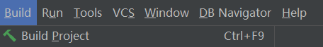

## 背景
开发、联调、测试阶段，需要密切关注数据的流转，应用的状态。常用的观察方式是看日志、看数据，但是有时候会很迷糊，程序流转到不确定的分支去了。这时候我们回去debug，

### 断点
前进
后退

### 条件断点

### watcher: 临时打印日志、修改变量

## 热更新
debug过程中修改代码，怎么生效
已经在测试环境运行，怎么快速更新、测试

### idea
开发环境热更新，可以在denug模式下，执行ctrl+F9。

### Jrebal
https://www.cnblogs.com/sansui6/p/17043448.html

### arthas
https://www.jianshu.com/p/544b78949469
https://zhuanlan.zhihu.com/p/429565721