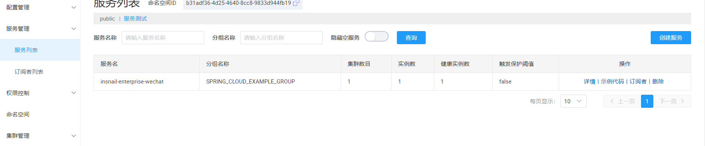

# nacos
阿里开源的注册和配置中心，支持CP模式和AP模式。注册中心本质也是一个命名服务，配置服务。

## 安装
[下载](https://nacos.io/zh-cn/docs/v2/quickstart/quick-start.html)

### 单机模式
```sh
# (1) 方式一：
startup.cmd -m standalone

# (2) 方式二：修改启动文件
rem set MODE="cluster"
set MODE="standalone"
```

打开链接：
http://127.0.0.1:8848/nacos

### 集群模式
```
```
## 注册中心

### 服务提供者

#### 创建服务命名空间
    可以指定id，不指定也会自动创建。
#### 配置服务
    指定服务名、nacos地址
#### 开启服务发现
    @EnableDiscoveryClient    
    启动可以看到服务：


[注册服务](https://zhuanlan.zhihu.com/p/265326422)

[Nacos和Feign的简单使用](https://blog.csdn.net/qq_37712731/article/details/107480075)

## 配置中心

