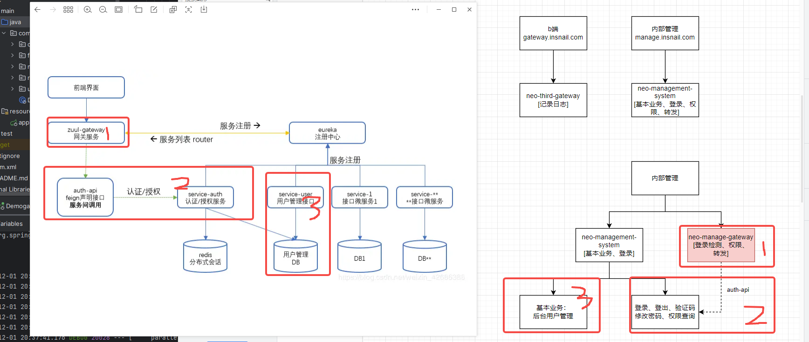
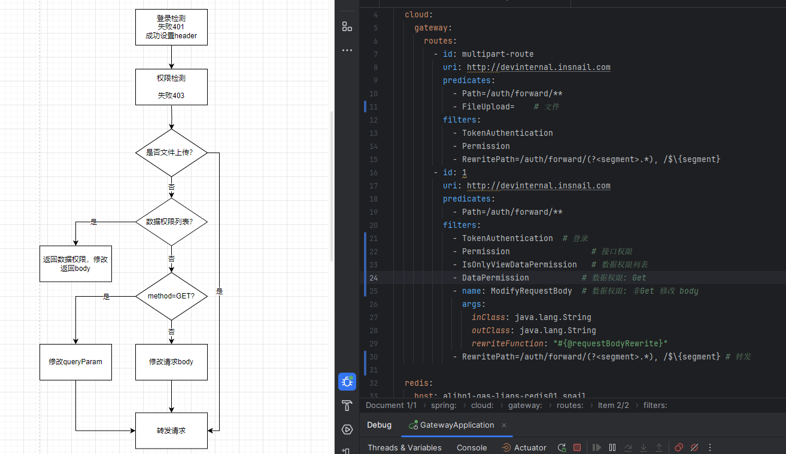

## 背景
### 内部的历史应用
之前的后台管理服务，有业务能力：查用户数据，有登录鉴权能力，有转发能力。由于没有做服务隔离、且超时时间比较是，一个服务转发挂了，会线程占用，整个服务挂掉。考虑改造成网关，并且分离业务能力和转发能力。

### 迁移设计
```
对路由配置，分为需要登录接口、不需要登录接口
里面的能力有：
    登录检测，token->operator
    权限拦截
        有无权限
        数据权限
    全局异常
    fallback(超时处理)
```

### 具体改造 
流程：

### 修改http status
### 修改header
### 地址调整
一开始以为是进来就错了

后来发现是权限修改导致
### 修改请求body
### 修改返回body
### 增加日志和调试
开启日志debug
写日志拦截打印
### 文件上传
### 返回json大小
### skywalking 传递trace_id
webflux    
### 配置文件问题
版本？文件！

### 注册中心+本地调试

#### zuul+Nacos

常规配置：
ip地址模式，使用 SimpleRouteLocator 处理
```yml
zuul:
    routes:
        hello-service:
            path: /api/hello-service/**
            url: http://hello-service:8080/ # hello-service是ip或者k8s内域名
```
服务注册模式：
使用 RibbonRoutingFilter 处理. 一个是url,一个是serviceId
```yml
# 方式一
zuul:
    routes:
        hello-service:
            path: /api/hello-service/**
            serviceId: hello-service
# 方式二0
zuul:
    routes:
        hello-service: /api/hello-service/**
```

#### gateway+Nacos 
基于地址
```yml
spring:
  cloud:
    gateway:
      routes:
        - id: hello-service
          uri: http://hello-service:8080 # hello-service是ip或者k8s内域名
          predicates:
            - Path=/api/hello-service/**
          filters:
            - StripPrefix=1        
```
基于注册，最大差别是uri值的写法不同
```yml
spring:
  cloud:
    gateway:
      routes:
        - id: hello-service
          uri: lb://hello-service
          predicates:
            - Path=/api/hello-service/**
          filters:
            - StripPrefix=1
```