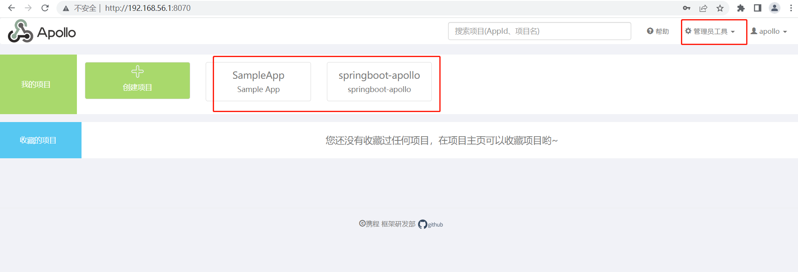

## 背景
配置中心作为系统中常用子系统，其功能一个是统一管理配置，其次是适应更新。目前流行的配置中心有apollo，spring config，Nacos等，这里主要说下apollo。

## 使用
### 一、安装apollo
#### (1)安装数据库和配置库表
数据库用mysql，我在window平台，用的免安装板5.6的。创建数据库，用的官方提供的sql。

[安装apollo](https://www.apolloconfig.com/#/zh/deployment/quick-start)

(mysql免安装链接：https://pan.baidu.com/s/1oQvYeYeMnsQ2etPXoZrPlA 提取码：vra9)

官方教程：

#### (2)启动apollo(需要JVM环境)
```
demo.sh start 
```
启动服务，启动之前需要设置下数据库账号、密码，数据库是上面已经创建好的。在git bash 启动服务后看到的日志，这个要等注册中心先启动，之后才会启动apollo服务和管理界面。

注意，启动需要一定的时间。启动完成可以看到日志：


对应的服务分别有：

* 注册中心：http://127.0.0.1:8080/


* apollo-adminservice: http://127.0.0.1:8090/，这个是主服务，管理配置数据的。

* 管理界面地址：http://localhost:8070，账号：apollo/admin


#### (3)启动自定义的项目
上面启动了服务端，创建一个简单的springboot项目，maven 配置：
```xml
<dependency>
    <groupId>org.springframework.cloud</groupId>
    <artifactId>spring-cloud-context</artifactId>
    <version>2.2.0.RELEASE</version>
</dependency>
<!-- apollo -->
<dependency>
    <groupId>com.ctrip.framework.apollo</groupId>
    <artifactId>apollo-client</artifactId>
    <version>1.7.0</version>
</dependency>
```
服务配置：
```yml
server:
  port: 8123 # 修改端口，避免冲突

app:
  id: springboot-apollo
apollo:
  meta: http://127.0.0.1:8080
  bootstrap:
    enabled: true
    eagerLoad:
      enabled: true
```
这样就可以在springboot项目使用apollo了。
### 二、使用配置

#### 1.连接apollo，读取配置
最简单的用法是使用注解@Value，普通的spring配置
```java
@Value("${xxx}")
```

#### 2.对象填充
AppConfig 
* 指定前缀：@ConfigurationProperties(prefix = "user")
* 加入配置：@Configuration
* 属性name、id从apollo加载

#### 3.数组填充
AppConfig
* 指定前缀："user"
* 列表属性：list
* 索引+字段
    user.list[0].name = hello
    user.list[0].id = 1

#### 4.map填充
AppConfig
* 指定前缀："user"
* 列表属性：maps
* 索引+字段        
    user.maps.first = 张飞
    user.maps.second = 李四
    user.collects = {1:张三，2:李四}

#### 5.demo  
配置项如下：
```java
hello = world hhhh
user.name = admin
user.id = 123
user.list[0].name = hello
user.list[0].id = 1
user.list[1].name = world
user.list[1].id = 2
user.list[2].name = 张飞
user.list[2].id = 3

user.maps.first = 张飞
user.maps.second = 李四
test.refresh = 你大爷123456
```
java 接收类：
```java
@Data
@Configuration
@ConfigurationProperties(prefix = "user")
public class AppConfig {
    private String name;
    private Integer id;
    private List<User> list;
    private Map<String，String> maps;
}
```

### 三、自动更新配置

#### 1.@Value自动刷新
@Value("${xxx}")

#### 2.RefreshScope + @ApolloConfigChangeListener
```java
org.springframework.cloud.context.config.annotation.RefreshScope
监听器:
ApolloConfigChangeListener，可以指定命名空间和前缀
刷新属性:
refreshScope.refresh("refreshConfig");
```    
配置类：
```java
@Configuration
@ConfigurationProperties(prefix = "test")
@RefreshScope
@Data
public class RefreshConfig {
    private String refresh;
}
```
刷新事件监听类：
```
@Component
@Slf4j
public class RefreshListener {

    @Resource
    RefreshScope refreshScope;

    @ApolloConfigChangeListener(interestedKeyPrefixes = {"test"})
    private void refresh(ConfigChangeEvent changeEvent){
        refreshScope.refresh("refreshConfig");
    }
}
```
#### 3.EnvironmentChangeEvent
```java    
监听器:
ApolloConfigChangeListener
更新Key:
applicationContext.publishEvent(new EnvironmentChangeEvent(changeEvent.changedKeys()));
```
事件监听类：
```java
@Component
@Slf4j
public class UserPropertiesRefresh implements ApplicationContextAware {

    private ApplicationContext applicationContext;

    @ApolloConfigChangeListener(interestedKeyPrefixes = {"user."})
    private void refresh(ConfigChangeEvent changeEvent){
        applicationContext.publishEvent(new EnvironmentChangeEvent(changeEvent.changedKeys()));
        log.info("change key: {}"，changeEvent.changedKeys());
    }

    @Override
    public void setApplicationContext(ApplicationContext applicationContext) throws BeansException {
        this.applicationContext = applicationContext;
    }
}
```
参考：[动态刷新配置](http://www.javashuo.com/article/p-zhzewvam-mk.html)
### 多环境管理
#### 使用namespace
这个的隔离级别并不友好
* [namespace](https://www.jianshu.com/p/6c9a7b78f20d)
  
#### 多节点
* [Apollo多环境部署](https://www.cnblogs.com/louwj/p/16017984.html)
#### 回滚
有个坑：apollo的回滚有问题，建议手动修改。看了官方的issue，好像是设计就是这样的，和使用习惯不同导致。未发布的是可以回滚的，已发布的会作为最新的发布点，是回滚不了的。
[1.2 版本回滚bug](https://github.com/apolloconfig/apollo/issues/1912)

### 刷新机制
http长轮询数据，不维护长连接
[认识长轮询：配置中心是如何实现推送的？](https://zhuanlan.zhihu.com/p/351196920)
