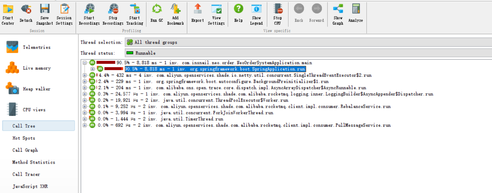
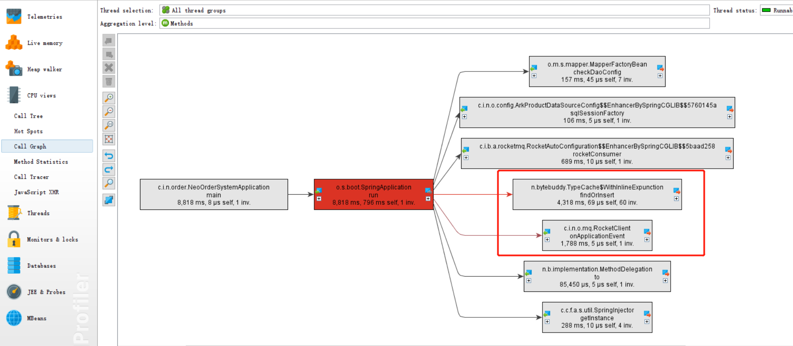
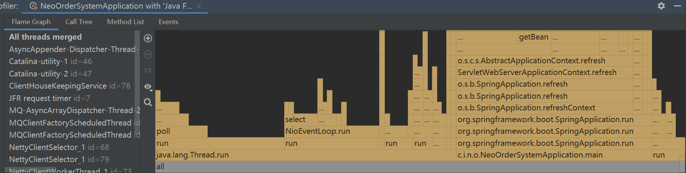
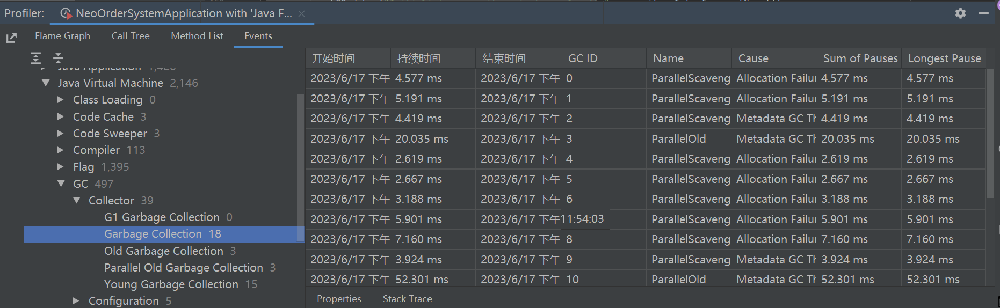
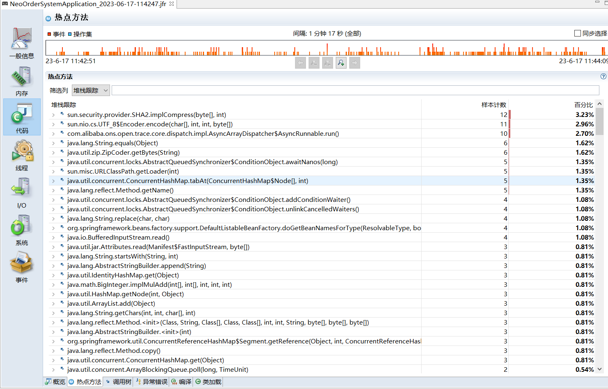
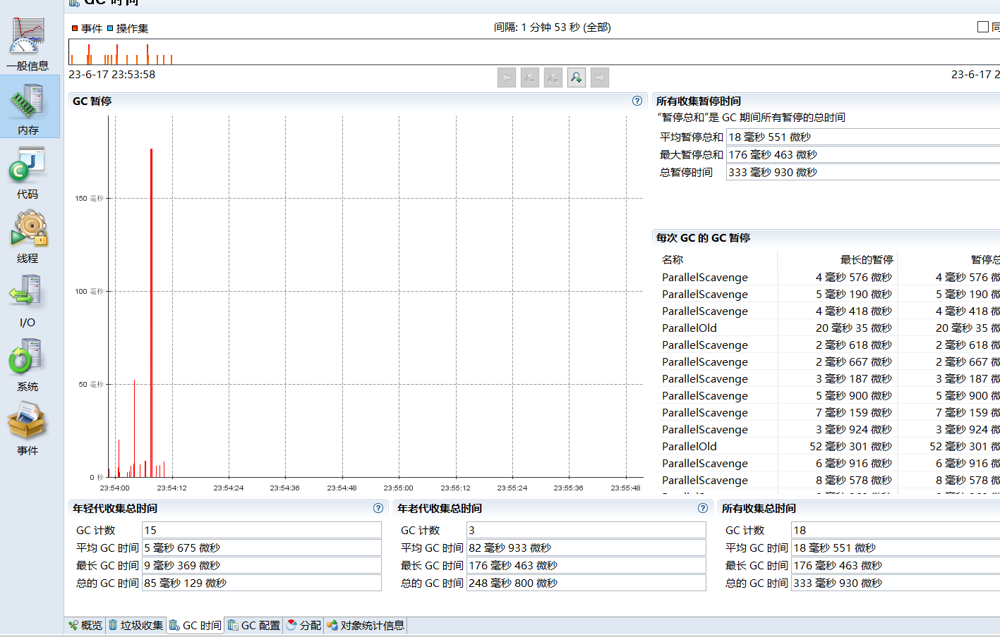

## 背景
>java程序启动，还是蛮快的，但是springboot的项目启动就很慢.为啥启动这么慢呢，能不能优化？这里暂时只涉及启动优化。

### 一、应用启动慢
>测试应用：内部有个springboot服务Order-System，依赖有数据库、redis、mq。启动耗时：
```log
Started NeoOrderSystemApplication in 81.579 seconds
```
#### （1）先问下chatGpt
```java
提问：springboot 启动慢怎么优化?
答案：
Spring Boot启动慢的原因可能有很多，以下是一些常见的优化建议：

优化依赖管理
依赖管理是影响Spring Boot启动时间的主要因素之一。建议使用合适的版本和精简的依赖来避免不必要的加载。在pom.xml文件中，可以排除不需要的依赖和模块。

启用Spring Boot的自动配置
Spring Boot提供了自动配置功能，它可以帮助我们更快地构建应用程序并节省时间。建议在项目中开启自动配置，并仔细检查是否有不必要的自动配置类。

减少扫描路径
Spring Boot会自动扫描整个classpath，以寻找服务和组件。这可能会导致启动缓慢的问题。建议尽可能减少扫描路径，只扫描必要的包和类。

使用懒加载
使用懒加载可以延迟Bean的初始化，从而减少启动时间。例如，在@Configuration注释上添加@Lazy注释以将Bean定义为懒加载。

配置线程池
在处理大量请求时，线程池可能会成为瓶颈。通过适当地配置线程池，可以使应用程序更好地利用系统资源。建议将线程池大小设置为适当的值，以避免过多或过少的线程。

配置缓存
在启动应用程序时，Spring Boot会预热缓存以提高性能。但是，如果缓存过大或数据量过于庞大，则会导致启动时间延长。建议使用适当的缓存策略，并配置合适的缓存大小。

启用日志级别调整
根据需要，可以将日志级别调整为更高或更低的级别。较高的级别可能会导致启动缓慢，而较低的级别可能会导致无法查看重要的信息。建议根据需要进行调整。

通过以上优化建议，可以显著减少Spring Boot的启动时间，并提高应用程序的性能和稳定性。

```
#### （2）思考
>有可行性的有：
* 第一点：依赖管理，这个maven依赖分析可以看看；
* 第三点：减少扫描路径；
* 第四点：使用懒加载
    
### 二、实践   
>先易后难，先试下懒加载 
#### （1）懒加载

```
问下chatGpt：springboot 懒加载

回答：
Spring Boot 中的懒加载是指在 Bean 实例化时，仅在需要使用该 Bean 的时候才会进行初始化。这种方式可以减少启动时的负载和时间，并提高应用程序的性能。
在 Spring Boot 应用程序中，可以通过以下的方式将 Bean 设置为懒加载：
1.在 @Bean 注解上添加 @Lazy 注解
2.在 application.properties 或 application.yml 文件中配置全局懒加载
spring.main.lazy-initialization=true

以上是几种常见的设置 Spring Boot Bean 懒加载的方式。在实际开发中，可以根据具体需求选择合适的方式进行设置。
```
结果：
```log
Started NeoOrderSystemApplication in 56.148 seconds
泰裤辣!81s下到了56s，有点夸张了。
```
#### （2）减少扫描路径
```
先PUA下chatGpt：springboot 减少扫描
```
```
回答：
在 Spring Boot 中，使用 @SpringBootApplication 或 @ComponentScan 注解扫描包的时候，默认会扫描整个类路径（classpath）。扫描路径较大会导致启动缓慢的问题。因此，我们可以通过以下方式来减少扫描路径：

1.将启动类放在根包下
2.在 @ComponentScan 注解上指定扫描路径
3.使用 excludeFilters 和 includeFilters 过滤特定的组件

总之，在实际开发中，我们应该尽可能减少扫描路径，这样可以有效地提高 Spring Boot 应用程序的启动速度和性能。
```
但是看了项目，以上几点项目已经基本做到了，搜索引擎查下springboot加载优化，看到有个spring-context-indexer的技术，maven配置：
```xml
<dependency>
  <groupId>org.springframework</groupId>
  <artifactId>spring-context-indexer</artifactId>
  <optional>true</optional>
</dependency>
```
结果：
```log
Started NeoOrderSystemApplication in 21.435 seconds
效果还可以，56s下到了21s.
```
参考：
[Spring 5 启动性能优化之 @Indexed](https://blog.csdn.net/zzuhkp/article/details/108257764)
#### （3）减少依赖
```
提问chatGpt：maven 去掉不用的依赖
回答：

在 Maven 项目中，可以使用以下两种方式去掉不用的依赖：

1. 使用 Maven Dependency Plugin 分析依赖关系
> $ mvn dependency:analyze

Maven Dependency Plugin 输出的结果会列出哪些依赖项未被使用，例如：
[INFO] The following dependencies were unused:
[INFO]   com.example:unused:jar:1.0-SNAPSHOT
 
然后，我们可以在 pom.xml 文件中移除这些依赖项。
2. 使用 Maven Enforcer Plugin 强制执行依赖项规则
Maven Enforcer Plugin 可以强制执行 Maven 项目中的一些规则，包括禁止使用某些依赖项。可以通过在 pom.xml 文件中配置 enforcer 规则来实现.

总之，在开发过程中，我们应该及时清理不用的依赖项，以避免对项目性能和安全造成影响。
```
试了下，不过结果有点不准，有些依赖是间接用上的，maven检测不出来。

### 观察和尝试
>上面这些方法都是全局优化的，针对具体的加载逻辑，有那些耗时呢?下面介绍几个观察的方式。
#### 日志记录bean加载时间
>spring加载bean有那些耗时操作?结合spring加载生命周期，实现BeanPostProcessor接口可以统计时间。
```
postProcessBeforeInitialization 记录开始时间
postProcessAfterInitialization  记录结束时间
```
代码：
```java
import com.alibaba.fastjson.JSON;
import lombok.Data;
import lombok.extern.slf4j.Slf4j;
import org.apache.commons.collections4.list.UnmodifiableList;
import org.springframework.beans.BeansException;
import org.springframework.beans.factory.config.BeanPostProcessor;
import org.springframework.boot.CommandLineRunner;
import org.springframework.stereotype.Component;

import java.util.*;

@Slf4j
@Component
public class BeanInitMetrics implements BeanPostProcessor, CommandLineRunner {
 private Map<String, Long> stats = new HashMap<>();
 private List<Metric> metrics = new ArrayList<>();

 @Override
 public void run(String... args) throws Exception {
  /**
   * 启动完成之后打印时间
   */
  List<Metric> metrics = getMetrics();
  log.info(JSON.toJSONString(metrics));
 }

 @Override
 public Object postProcessBeforeInitialization(Object bean, String beanName) throws BeansException {
  stats.put(beanName, System.currentTimeMillis());
  return bean;
 }

 @Override
 public Object postProcessAfterInitialization(Object bean, String beanName) throws BeansException {
  Long start = stats.get(beanName);
  if (start != null) {
   metrics.add(new Metric(beanName, Math.toIntExact(System.currentTimeMillis() - start)));
  }
  return bean;
 }

 public List<Metric> getMetrics() {
  metrics.sort((o1, o2) -> {
   try {
    return o2.getValue() - o1.getValue();
   } catch (Exception e) {
    return 0;
   }
  });
  log.info("metrics {}", JSON.toJSONString(metrics));
  return UnmodifiableList.unmodifiableList(metrics);
 }

 @Data
 public static class Metric {
  public Metric(String name, Integer value) {
   this.name = name;
   this.value = value;
   this.createDate = new Date();
  }

  private String name;
  private Integer value;
  private Date createDate;

 }
}
```
得到bean时间日志,这几个xxxEntityManagerFactory是和数据库资源相关的：
```
[
    {
        "createDate": 1686846750336,
        "name": "liansEntityManagerFactory",
        "value": 6410
    },
    {
        "createDate": 1686846750352,
        "name": "arkEntityManagerFactory",
        "value": 3385
    },
    {
        "createDate": 1686846750284,
        "name": "insuranceEntityManagerFactory",
        "value": 1669
    }
]
```
想法：
1.这部分看起来是没有做懒加载也没有做异步加载。异步加载bean技术，SOFA提供了一个方案: 使用线程处理init方法。
2.功能优化：部分功能其实已经业务过期了，无用的数据库表要下掉。

去掉无关的数据库调用对象，时间：
```log
Started NeoOrderSystemApplication in 12.068 seconds 
```

#### 启动日志分析
这里我没有看springboot的详细启动，主要从日志看springboot 启动事件，看到做的事情有：
* 1-加载banner
* 2-spring data 扫描数据源
* 3-Tomcat 容器启动
* 4-加载Jpa的映射库dao/Repository
* 5-MVC 启动
* 6-MQ 消费者

开启debug级别日志，看日志有很多时间是耗费在jpa 代理的生成，这个在jprofiler也能看到。看了一些文章得到的建议是：
```yml

spring.jpa.hibernate.ddl-auto=none
spring.jpa.properties.hibernate.temp.use_jdbc_metadata_defaults=false
spring.data.jpa.repositories.bootstrap-mode=lazy

删除用重复的QuerydslPredicateExecutor接口
```    
结果：
```log
Started NeoOrderSystemApplication in 9.949 seconds
第一次突破10s大关！
```
参考：
[Speed up Spring Boot Startup](https://www.baeldung.com/spring-boot-startup-speed)
[记一次JPA项目启动速度优化](https://www.freesion.com/article/20951047779/
)

#### 方法级别的观察：Profile 
>打印火焰图，
用async-profile打印火焰图，可以通过idea或者arthas操作，不过我是windows系统，用的jprofiler查看cpu viewer：





图中看到耗时主要是：一个是Hibernate/Jpa创建字节码，另一个是阿里云MQ初始化。

>windows下idea里的profile是基于jfr的，以下是chatGpt的jfr介绍和使用。

```
提问chatGpt：JFR使用 
回答：
Java Flight Recorder（JFR）是 JDK 自带的一个性能分析工具，可以捕获应用程序执行期间的数据和事件。JFR 通常会记录以下类型的数据：

CPU 使用率、线程数、内存使用量等系统指标。
方法调用、锁状态、IO 操作等运行时信息。
垃圾收集信息、类加载情况等 JVM 相关信息。
JFR 可以生成丰富的数据报告，从而帮助开发人员进行性能分析和故障排除。

以下是使用 JFR 的一般步骤：

1.启用 JFR
JFR 默认情况下未启用，需要在启动时显式地启用它。可以通过以下命令来启用 JFR：
java -XX:+UnlockCommercialFeatures -XX:+FlightRecorder ...
其中 -XX:+UnlockCommercialFeatures 开启了商业特性，-XX:+FlightRecorder 启用了 JFR。

2.分析数据
一旦 JFR 数据收集完成，就可以使用 JFR 工具来分析数据了。JDK 自带了一个名为 jcmd 的命令行工具，可以用它来分析和导出 JFR 数据。例如，以下命令可以列出当前正在运行的 JVM 进程，并显示它们的 PID 和名称：

jcmd -l
要导出 JFR 数据，可以使用以下命令：
jcmd <PID> JFR.dump filename=<filename>
其中 <PID> 是 JVM 进程的 ID，<filename> 是导出文件的名称和路径。

3.使用 JMC
Java Mission Control（JMC）是一个用于监视和管理 Java 应用程序的工具套件，包括对 JFR 数据的查看和分析功能。可以使用 JMC 打开 JFR 数据文件，然后查看各种性能指标、方法调用和线程活动等信息。

以上是使用 JFR 的一般步骤。JFR 提供了丰富的性能分析和故障排除功能，可以帮助开发人员更好地优化应用程序的性能和稳定性。
```
在idea导航栏Run-->Run with Profiler，idea可能异常，需要设置启动参数-XX:+UnlockCommercialFeatures。得到下图：


还有GC事件数据：


在JMC中查看：

GC:


从2图中其实看不出什么，倒是看到初始化阿里云的MQ初始化有点慢。至于GC 总时间是330多ms，优化意义不大。

### 一些尝试和坑

#### sofa 异步加载
>试用了下还行，但是要改动代码，里面是针对对象创建做了初始化，需要配置异步并且指定一个init方法交给线程。

参考：[Spring Bean 异步初始化](https://www.sofastack.tech/projects/sofa-boot/bean-async-init/)

#### 域名解析导致的延迟
>数据库，redis，mq 是通过域名配置，windows有时候域名解析有问题，会导致加载时间延长。本地可以改host配置，或者直接改成ip连接，其他环境不用动。

参考：[Windows下SpringBoot启动非常慢排查经历](https://zhuanlan.zhihu.com/p/356973139)

#### 避坑指南
>1.在测试过程中有几点坑，首先是延迟加载会导致启动应用之后是部分请求触发了真正的加载，时间会牺牲在第一次请求这里。

>2.spring-context-index 会有部分bean加载不到，比如swagger的配置。

参考：
[这样优化Spring Boot，启动速度快到飞起!](https://juejin.cn/post/7122750700081135646)

### 总结

回头看，做启动优化可能意义不大，因为很多技巧只适合在本地使用，但是，在这个过程中，涨了很多的知识。
* 了解spring-context-indexer技术
* 使用arthas\profile，打印火焰图，查看CPU\线程\内存\IO\堆\GC，使用Jprofiler和JMC工具分析程序性能
* 解构spring bean的生命周期，可以是在对应节点打印日志，可以是改写同步变异步，sofa 异步加载bean也是在生命周期做的处理。