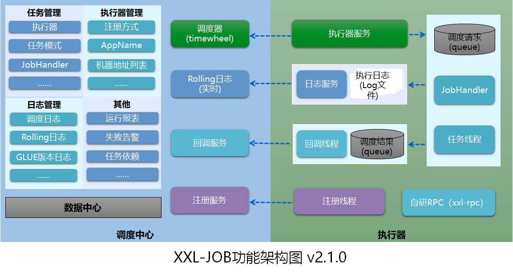
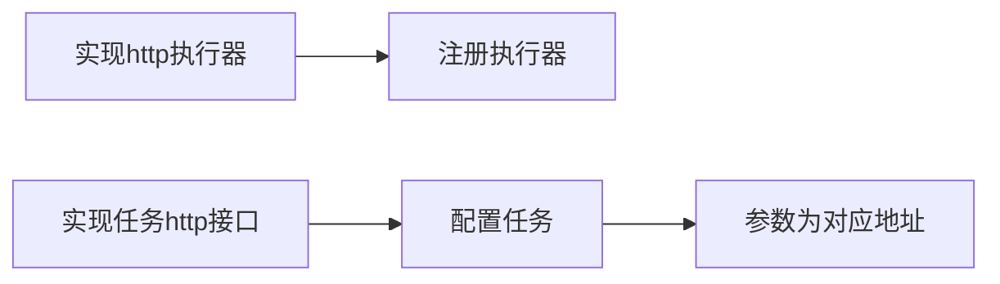

## 背景
定时任务是系统日常常用功能之一。常用定时器有java Timer、ScheduledThreadPoolExecutor、Quartz、netty 时间轮和Spring Job。不过这些都是单节点的、内存中的调度，存在调度失败、单节点问题。

## 分布式调度
* 1. 持久化
* 2. 分片
* 3. 有且只有一次：可重试、调度策略、幂等
* 4. 日志：记录执行事件和结果
### 分离式设计
```java
1.调度器和执行器分离
    只需要定义执行器，调度器可配置
2.业务控制
    实现一个http执行器，业务层实现http接口和控制幂等，收集日志和做好回调。
```
xxl-job 架构图：

### 简单做法
```java
    mysql+Quartz
```
## xxl-job     
### 1.安装
[xxl-job](https://www.xuxueli.com/xxl-job/)
  mysql 建表，配置数据库

### 2.启动
[XXL-JOB定时任务调度平台原理](https://cloud.tencent.com/developer/article/1873194)

### 3.定时任务
#### 实现执行器：jobHandler

考虑到如果实现大量执行器，业务代码会有点奇怪。这个模式还有一种做法：
实现一个http通用的执行器

#### GLUE 模式

