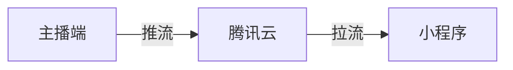
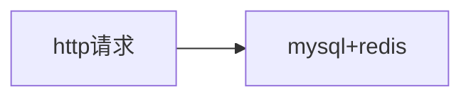
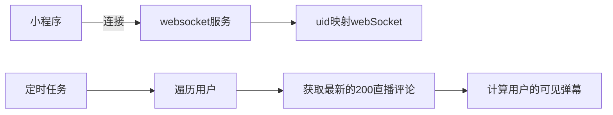

## 背景
### 微信小程序直播

```mermaid
graph LR

A[主播端]-->|推流|B[腾讯云]-->|拉流|C[小程序]
```

### 评论、弹幕
用户发送弹幕：

```mermaid
graph LR
A[http请求]-->B[mysql+redis]
```

服务端推送弹幕：

```mermaid
graph LR
A[小程序]-->|连接|B[websocket服务]-->C[uid映射webSocket]

D[定时任务]-->E[遍历用户]-->F[获取最新的200直播评论]-->G[计算用户的可见弹幕]
```

这里的弊端是：
1. 推送可以先去kafka，再消费。而且可以看一次合并一批弹幕，减少mysql的写入。
2. 评论使用拉模式，定时器会导致集中请求。
3. 评论存在mysql是否合适？