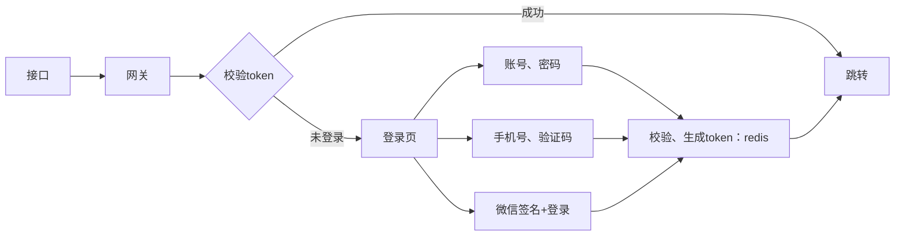
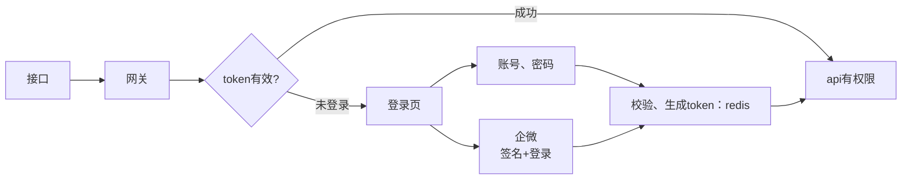
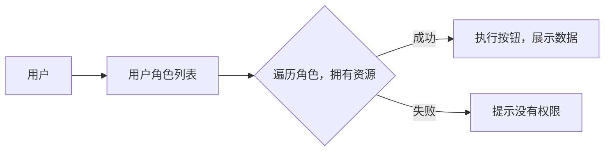

## 背景
整理下内部的登录系统架构

### C端用户身份鉴权
```sql
-- 用户表
user 
    uid、姓名、头像、手机、密码、wxUnionId
```


网关会区分接口是否需要登录

### B端用户身份鉴权
```sql
-- 内部人员表
user 
    id、姓名、手机、邮箱、密码、企微账号
```

登录过程:


#### 登录加密
账号，密码，盐-->token-->Redis 会话，sso 登录

#### RBAC: shiro
权限是基于角色和资源的。

对象：
    资源：菜单、按钮、接口
    用户

关系：
    角色--资源
    用户--角色        


实现：
1.对接口注解？
2. key+uid: {Get/url,uid} 查询

#### 数据权限
实现：
1. key+uid: {Get/url,keyWord,uid} 查询

### 用户、登录、权限具体设计
服务职责:
    用户系统：
    (1)用户基本信息
    (2)用户登录、登出、第三方登录
    网关：
    (3)鉴权、转发
目前没有分离登录，所以用户基本信息和登录放在一起。

参考:
[手把手教你集成spring cloud + shiro微服务框架](https://gitee.com/admin_yu/micro-svc)

### 设计
#### 系统对象
对象：
    用户
    资源
    角色
    组织
    接口资源

关系：
    角色-资源
    用户-角色
    组织-角色

### 接口

#### 登录、登出、邮箱验证码、修改密码、

#### 用户\角色\资源\组织：CRUD
