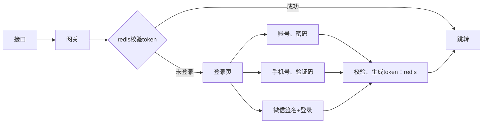
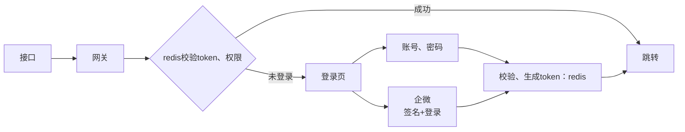

## 背景
整理下内部的登录系统架构

### C端用户身份鉴权
```sql
-- 用户表
user 
    uid、姓名、头像、手机、密码、wxUnionId
```


```mermaid
graph LR
A[接口]-->B[网关]-->C{redis校验token}

C-->|成功|D[带着userId，进入下层]
C-->|未登录|E[登录页]-->F1[账号、密码]-->G[校验、生成token：redis]-->D[跳转]
E-->F2[手机号、验证码]-->G
E-->F3[微信签名+登录]-->G
```
网关会区分接口是否需要登录

### B端用户身份鉴权
```sql
-- 内部人员表
user 
    id、姓名、手机、邮箱、密码、企微账号
```


```mermaid
graph LR
A[接口]-->B[网关]-->C{redis校验token、权限}

C-->|成功|D[带着userId，进入下层]
C-->|未登录|E[登录页]-->F1[账号、密码]-->G[校验、生成token：redis]-->D[跳转]
E-->F3[企微
签名+登录]-->G
```

