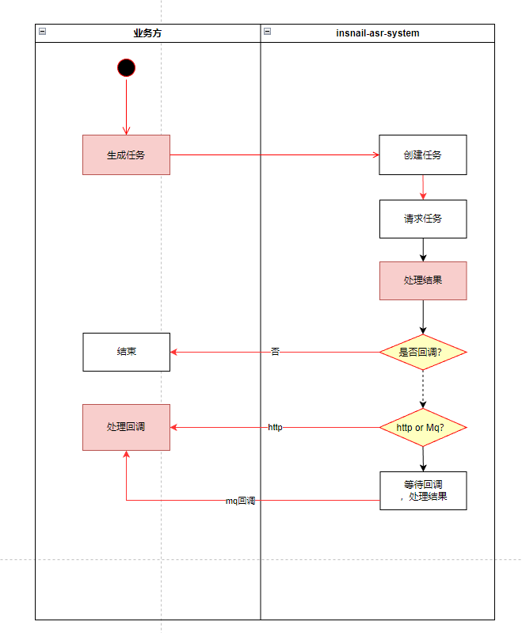

## 场景
和第三方对接，有时候对方提供的不是sdk，只是一个http接口，并且是异步调用，然后再回调回来。

### 同步
普通的接口请求：
    http同步：request-->response，这种比较简单。

### 异步：
    http请求，马上返回成功，再获取结果：
    （1）http回调
    （2）http轮询
    （3）mq回调
    这种的好处是，可以发起大量请求，但是系统会复杂。

异步回调：

异步轮询：

### 隔离第三方，引入中间服务

这个的好处是，业务方和第三方无感知。同时中间服务管理每次调用，留存交互记录。坏处是架构变得复杂了。

### 支付
1. 拉起支付：记录日志、回调信息。这个时候要等待用户支付
2. 支付回调：接收支付结果
3. 根据单号+回调信息，回调业务方
   
### 渠道商
1. 支付、承保
2. 回调

### asr\ocr\chatGpt内部Ai系统

### 参考代码

## 总结
1.结论出去的请求与回调的结果