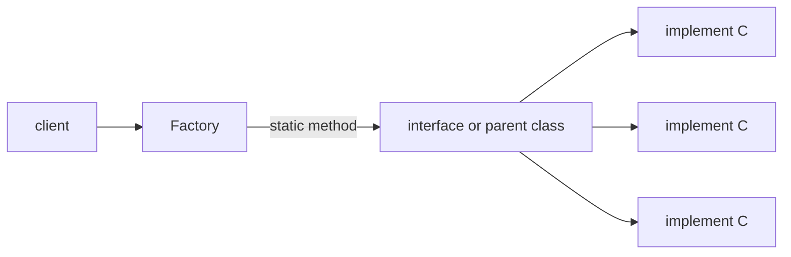
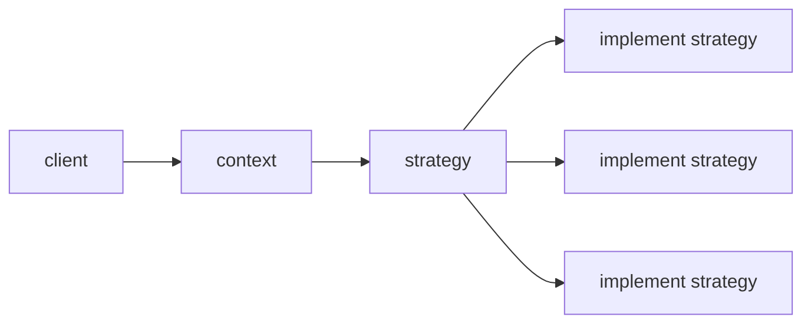

## 工厂模式


```java
public class Client {
    public static void main(String[] args) {
        System.out.println(Factory.getC("E").getName());
    }
}

class Factory {
    public static C getC(String key) {
        switch (key) {
            case "D":
                return new D();
            case "E":
                return new E();
            case "F":
            default:
                return new F();
        }
    }
}

interface C {
    String getName();
}

class D implements C {
    @Override
    public String getName() {
        return "D";
    }
}

class E implements C {
    @Override
    public String getName() {
        return "E";
    }
}

class F implements C {
    @Override
    public String getName() {
        return "F";
    }
}
```

## 策略模式

这个和上面的工厂模式非常像，只是工厂的目标是获取对应对象。策略模式是在于选择动作执行

```java

import java.util.Scanner;

public class Client {
    public static void main(String[] args) {
        // 工厂生产策略对象
        Strategy strategy = StrategyFactory.getStrategy("+");
        // 在策略上下文注入策略
        StrategyContext context = new StrategyContext(strategy);
        // 执行动作，里面会调度策略  System.out.println 可以放到 handle里面
        System.out.println(context.handle(1, 2));

        Scanner scanner = new Scanner(System.in);
        int numberA = scanner.nextInt();
        int numberB = scanner.nextInt();
        scanner.nextLine();
        String operator = scanner.nextLine();
        context.setStrategy(StrategyFactory.getStrategy(operator));
        System.out.println(context.handle(numberA, numberB));
    }
}

class StrategyContext {
    Strategy strategy;

    public StrategyContext(Strategy strategy) {
        this.strategy = strategy;
    }

    public void setStrategy(Strategy strategy) {
        this.strategy = strategy;
    }

    public int handle(int numberA, int numberB) {
        return strategy.operator(numberA, numberB);
    }
}

class StrategyFactory {
    public static Strategy getStrategy(String key) {
        switch (key) {
            case "-":
                return new SubStrategy();
            case "*":
                return new MulStrategy();
            case "/":
                return new DivStrategy();
            case "+":
            default:
                return new AddStrategy();
        }
    }
}

interface Strategy {
    int operator(int numberA, int numberB);
}

class AddStrategy implements Strategy {
    @Override
    public int operator(int numberA, int numberB) {
        return numberA + numberB;
    }
}

class SubStrategy implements Strategy {
    @Override
    public int operator(int numberA, int numberB) {
        return numberA - numberB;
    }
}

class MulStrategy implements Strategy {
    @Override
    public int operator(int numberA, int numberB) {
        return numberA * numberB;
    }
}

class DivStrategy implements Strategy {
    @Override
    public int operator(int numberA, int numberB) {
        return numberA / numberB;
    }
}
```
## 责任链模式+建造者模式

## 模板模式+策略模式
用于固定部分统一的行为，同时分离一部分修改点
```maermaid
graph LR 

A[client]->
```
```java
abstract class Operator{
    public int cal(){
        // 输入两个数
        // 输入算符
    }
} 
```
## 适配器模式

### 角色

- 接口A

- 接口B

- 上下文：实现接口B,同时持有接口A【组合】

- 客户端：持有上下文，调用接口B
  
